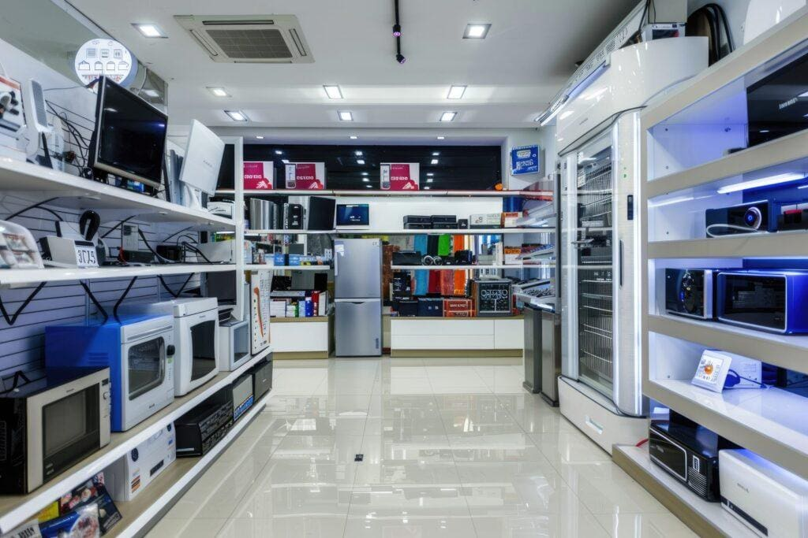
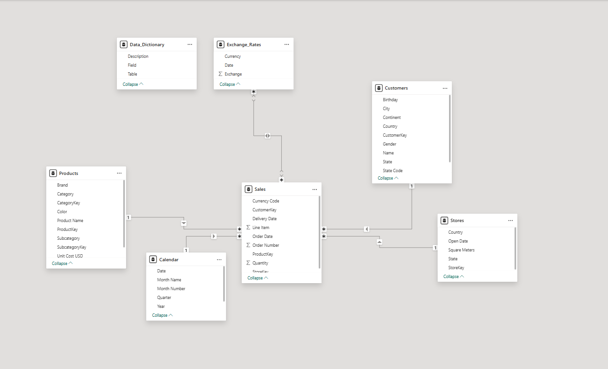
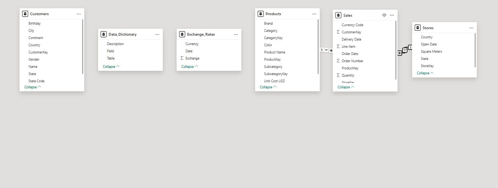
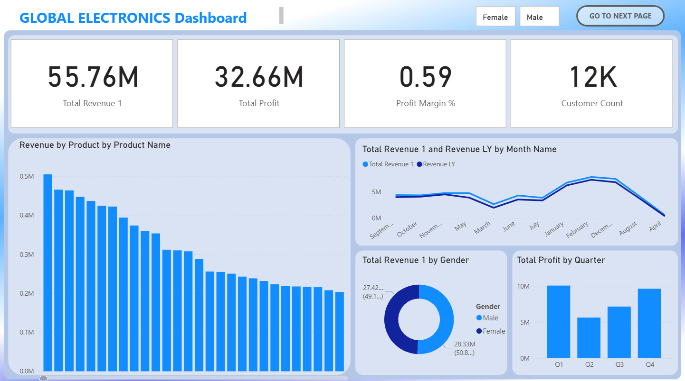
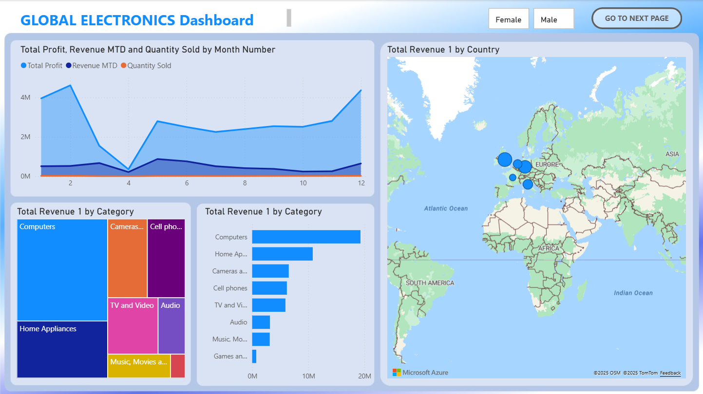

#  Global Electronics Retailer Sales Dashboard  

Built with **Power BI** | Data Cleaning + Data Modeling + Visualization  

---

---
##  Project Overview  

This project analyzes the performance of **Maven Electronics**, a global retailer that sells electronics and appliances through both **online** and **in-store** channels.  

The goal was to design an **interactive Power BI dashboard** that helps management track KPIs, identify sales trends, and make **data-driven decisions** to boost profitability and customer satisfaction.  

---

##  Business Problem  

Maven Electronics has been facing a **steady decline in revenue since 2020**.  
Management struggled to gain a complete picture of business performance due to fragmented and disconnected data sources.  

### Key challenges identified:
1. **No unified reporting system** — Data scattered across multiple files (sales, products, customers, stores, exchange rates) made analysis time-consuming.  
2. **Limited visibility into performance drivers** — Difficulty identifying which **products**, **regions**, or **customer segments** were driving growth or losses.  
3. **Inability to track profitability** — Lack of integrated KPIs for **revenue**, **cost**, and **profit margins**.  
4. **Inefficient decision-making** — Static reports prevented **real-time exploration** and **data-driven insights**.  

###  Goal
To design a **consolidated Power BI sales performance dashboard** that:
- Combines all datasets into a **star schema model**  
- Tracks **key performance indicators (KPIs)** — Revenue, Profit, Customer Count, and Growth Trends  
- Provides **interactive visual analysis** by product, region, and customer demographics  
- Enables management to make **faster, smarter, and evidence-based decisions**

---

##  Data Model — *Star Schema*  

**Fact Table:**  
- `Sales` → transaction-level data (Order Date, Quantity, Currency, etc.)

**Dimension Tables:**  
- `Customers` → demographics (Gender, City, Country, Birthday)  
- `Products` → details (Brand, Category, Unit Cost, Unit Price)  
- `Stores` → store info (Region, Country, Open Date)  
- `ExchangeRates` → currency conversion data  
---

---
**Relationships:**  
- Sales[CustomerKey] → Customers[CustomerKey]
- Sales[ProductKey] → Products[ProductKey]
- Sales[StoreKey] → Stores[StoreKey]
- Sales[Currency/Date] → ExchangeRates[Currency/Date]

This was the recommendation of Power BI before I redesigned using a **clean star schema** to ensure optimized performance and accurate relationships.
---

---
 

---

##  Key Measures (DAX)

| Measure | Formula | Purpose |
|----------|----------|----------|
| **Total Revenue** | `SUMX(Sales, Sales[Quantity] * RELATED(Products[Unit Price]))` | Calculates total company revenue |
| **Total Cost** | `SUMX(Sales, Sales[Quantity] * RELATED(Products[Unit Cost]))` | Calculates total cost of goods sold |
| **Total Profit** | `[Total Revenue] - [Total Cost]` | Company profit |
| **Profit Margin %** | `DIVIDE([Total Profit], [Total Revenue], 0)` | Profitability ratio |
| **Revenue (USD)** | `SUMX(Sales, Sales[Quantity] * RELATED(Products[Unit Price]) * RELATED(ExchangeRates[Rate]))` | Converts all revenue to USD |
| **Revenue LY** | `CALCULATE([Total Revenue], SAMEPERIODLASTYEAR('Date'[Date]))` | Revenue from last year |
| **YoY Revenue Growth %** | `DIVIDE([Total Revenue] - [Revenue LY], [Revenue LY], 0)` | Year-over-year growth |

---

## Dashboard Pages
### Page 1 — KPI Overview

- **Top Cards:** Total Revenue, Profit, Margin %, Customer Count
- **Trend Line:** Revenue over time (monthly)
- **Bar Charts:** Revenue by Product Category / Region
- **Donut Chart:** Customer Demographics (Gender, Age)
---

---
### Page 2 — Performance Insights

- Revenue, Profit, and Quantity Trends
- Top 10 Products by Revenue
- Regional Performance Map
- Customer Segmentation & Behavior
---

---

## Skills Demonstrated

- Data Cleaning & Modeling (Excel → Power BI)
- DAX Calculations & Time Intelligence
- Dashboard Design & Storytelling
- Insight Presentation

## Tools Used

- Power BI Desktop — Data modeling, DAX, visualization
- Excel — Data cleaning and preparation
- Power Query — ETL transformation
- DAX Studio — Performance tuning

## Author

**Ekele Patrick Emmanuel**

Data Analyst | Medical Radiography Student

 **LinkedIn:** www.linkedin.com/in/emmanuel-patrick-5391a638b
 
**Email:** ekelepatrick7@gmail.com 

## Summary

This project demonstrates how to integrate multiple data sources into a robust Power BI model, apply DAX measures for analytical depth, and build a polished executive dashboard that turns raw sales data into actionable insights.
